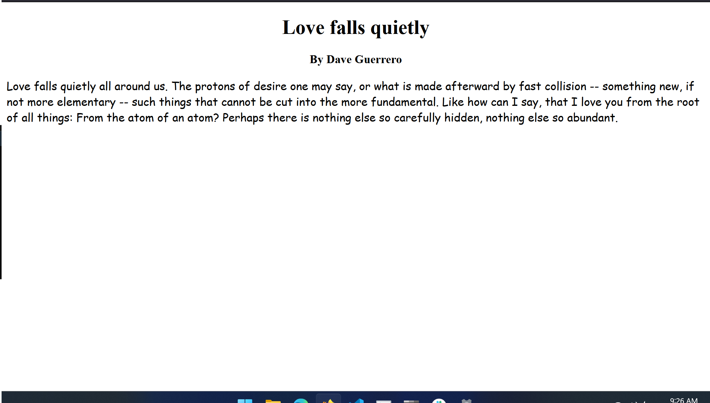

# CSS Intro

## Assignment: Poem Page

For this assignment you will create a page to display a poem and its author

### Instructions
Add content to webpage (index.html):
- Render the title of the poem with a header tag (h1, h2, or h3) 
- Render the author of the poem with a header tag (h1, h2, or h3)
- Render the words of the poem with a p tag (p)

Style the content of the webpage (index.html):
- Make the title appear in the center of the page using the margin property or text-align property
- Make the author appear in the center of the page using the margin property or text-align property
- Make the words of the poem appear in a different font

Take a look at Example.png for an idea of how the end result should look.
